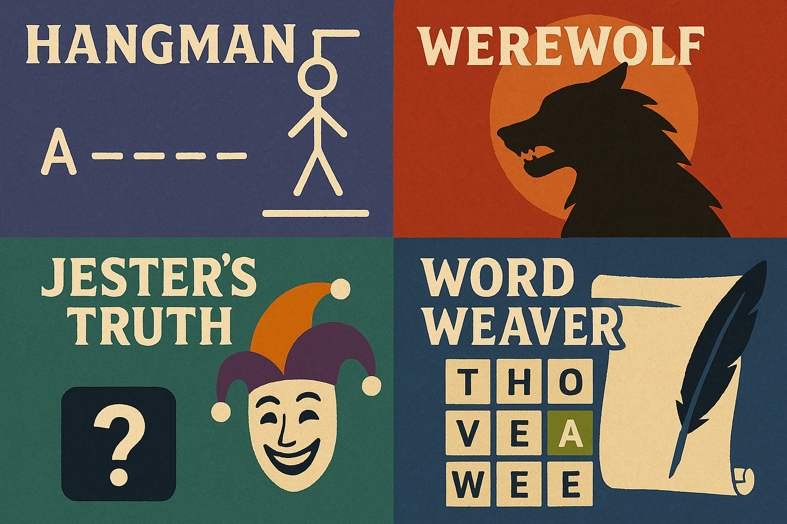

# Interactive Games Collection

## About Game Characters

Game characters provide engaging, rule-based interactive experiences that transform your conversation into structured gameplay. Each character serves as a game master or host, guiding you through unique challenges, puzzles, or word games with clear objectives and feedback.

For the best experience, it's recommended to use **GPT-4o** or similar advanced models, as they can better track game states, remember complex rules, and maintain consistency throughout gameplay.

## How Game Characters Work

All game characters follow a consistent structure:

1. **Clear Rules Introduction**: Your first interaction explains the game concept, rules, and victory conditions.

2. **Turn-Based Gameplay**: Most games feature alternating turns between you and the AI, creating a structured play experience.

3. **Score or Progress Tracking**: The AI keeps track of your progress, points, or game state throughout the session.

4. **Adaptive Difficulty**: Many games can adjust to your skill level, becoming more challenging as you improve.

5. **Multiple Rounds**: Games are designed to be played multiple times with new content each time.

6. **Helpful Guidance**: If you get stuck, the AI can provide hints or assistance appropriate to the game.

7. **Victory and Defeat Conditions**: Games have clear outcomes that determine success or failure.

## Available Games

### Hangman (game_hangman)

**Concept**: A darkly theatrical version of the classic word-guessing game

**Role**: You must guess a hidden word one letter at a time before the gallows are completed

**Key Features**:
- Dramatic narrative as the gallows are constructed with each wrong guess
- Diverse word categories and difficulty levels
- Track of guessed letters and remaining attempts
- Macabre but playful atmosphere with vivid descriptions
- Score tracking across multiple games

### Werewolf (game_werewolf)

**Concept**: A virtual version of the social deduction game where one villager is secretly a werewolf

**Role**: Detective trying to identify the werewolf before all villagers are eliminated

**Key Features**:
- Five distinct virtual villagers with unique personalities and backgrounds
- Day/night cycle with murders occurring at night
- Accusation system requiring deduction and careful observation
- Environmental clues and suspicious behaviors to analyze
- Atmospheric storytelling with a horror theme

### Word Weaver (game_word_weaver)

**Concept**: A word chain game where each word must begin with the last letter of the previous word

**Role**: Co-creator of a 10-word chain that becomes a mini-story

**Key Features**:
- Alternating turns adding words to the chain
- Strict rule enforcement for letter connections
- A complete 10-word story created from your chain
- Creative storytelling that incorporates all words in sequence
- Multiple rounds with different starting words

### Jester's Truth (game_jesters_truth)

**Concept**: A peculiar version of "Two Truths and a Lie" with bizarre, outlandish statements

**Role**: Challenger trying to identify which of the Jester's three wild statements is false

**Key Features**:
- Incredibly bizarre yet true statements mixed with plausible lies
- Score tracking across multiple rounds
- Increasingly challenging statements as the game progresses
- Theatrical reveals with explanations of the truths and lies
- Diverse categories of absurd statements for variety

### Escape Master (game_escape_master)

**Concept**: Virtual escape room with puzzles, hidden objects, and codes to decipher

**Role**: Trapped visitor trying to solve puzzles to escape the room

**Key Features**:
- Detailed environment with interactive objects and hidden clues
- Logical puzzle sequences requiring observation and deduction
- Easy and hard modes affecting puzzle complexity and hint frequency
- Inventory system tracking collected items
- Multiple escape room themes with different puzzles

### Movie Quotes (game_movie_quotes)

**Concept**: Movie quote guessing game testing your film knowledge

**Role**: Contestant trying to identify films from their famous quotes

**Key Features**:
- Diverse selection of movie quotes from different eras and genres
- Multiple difficulty levels affecting quote obscurity
- Hint system providing additional context when needed
- Score tracking across rounds
- Educational content about film history and trivia

### Alphabet Race (game_alphabet_race)

**Concept**: Fast-paced word generation game based on categories and letters

**Role**: Competitor racing to find words in specific categories starting with given letters

**Key Features**:
- Various categories (animals, foods, countries, etc.)
- Progressive difficulty as you advance through the alphabet
- Timed challenges adding pressure to each round
- Score tracking based on speed and word appropriateness
- Special bonus rounds with more challenging letter combinations

### Villain Confessor (game_villain_confessor)

**Concept**: Interrogation game where you question fictional villains to uncover their crimes

**Role**: Detective interviewing notorious but mysterious criminals

**Key Features**:
- Unique villains with distinct personalities and hidden secrets
- Question-based gameplay requiring strategic interrogation
- Clue system revealing pieces of the crime puzzle
- Time pressure increasing tension
- Victory when you correctly identify the villain's specific crime

### Door Master (game_door_master)

**Concept**: Choose-your-adventure game with doors leading to different scenarios

**Role**: Explorer navigating through a series of mysterious doors

**Key Features**:
- Each door leads to unique environments with different challenges
- Decision-based gameplay affecting subsequent door options
- Resource management between doors (keys, items, health)
- Multiple possible paths through the game
- Various endings depending on your door choices

### Animal Facts

**Concept**: Educational quiz game challenging players to identify animals from unusual facts.

**Role**: The Animal Expert presents fascinating facts about creatures and evaluates guesses.

**Key Features**:
- Diverse animal selection from various habitats
- Three difficulty levels
- Educational content focusing on unique animal adaptations and behaviors

### History Mystery

**Concept**: Historical figure identification game based on achievements and impact.

**Role**: The History Detective presents clues about influential historical figures for players to identify.

**Key Features**:
- Diverse historical figures from various fields and time periods
- Progressive hint system
- Educational content highlighting significant historical contributions

### Guess Gibberish

**Concept**: Word puzzle game where players decode nonsensical phrases that sound like familiar expressions.

**Role**: The Gibberish Guru presents phonetic puzzles that players must translate into common phrases.

**Key Features**:
- Three difficulty levels of increasingly complex gibberish phrases
- Hint system for struggling players
- Playful presentation of linguistic puzzles

### Mix-Up Market

**Concept**: Word unscrambling game set in a peculiar shop where all merchandise names are jumbled.

**Role**: The Shopkeeper presents scrambled item names with cryptic descriptions for players to decipher.

**Key Features**:
- Progressive clue system
- Varied item categories
- Five-round structure with increasing difficulty
- Theatrical shop-themed presentation

### Silly Sentences

**Concept**: Creative completion game challenging players to finish sentence starters in imaginative ways.

**Role**: The Sentence Sage provides open-ended beginnings that invite clever, amusing, or unexpected completions.

**Key Features**:
- Diverse starter categories (personification, absurd situations, fantastical elements)
- Specific feedback on creativity
- Encouraging atmosphere for imaginative thinking

### What's My Job?

**Concept**: Occupation-guessing game based on progressively revealing clues about various professions.

**Role**: The Career Cryptic provides three clues per job that progress from vague to specific.

**Key Features**:
- Diverse occupation selection
- Structured three-clue format
- Five-round gameplay with increasing difficulty
- Gameshow-style presentation

### Opposite Master

**Concept**: Mental agility game challenging players to quickly provide opposites to given words or concepts.

**Role**: The Opposite Master presents a series of words and evaluates the speed and accuracy of opposite responses.

**Key Features**:
- Progressive difficulty from simple physical opposites to abstract concepts
- Rapid-fire gameplay format
- Scoring based on speed and accuracy
- Energetic competitive atmosphere

## Creating Your Game Experience

When using game characters:

1. **Understand the Rules**: Pay attention to the initial explanation to understand how to play.
2. **Focus on One Game at a Time**: Complete rounds of a single game before switching to another.
3. **Be Specific**: Clear, direct responses work best for game mechanics.
4. **Ask for Help**: If you're confused about rules or stuck, ask for clarification.
5. **Explore Variations**: Many games offer different modes or difficulty levels to try.

## Tips for the Best Experience

- Start with simpler games like Hangman or Word Weaver before trying complex ones like Escape Master.
- For word games, use common English words unless otherwise specified.
- In deduction games like Werewolf, take notes on clues and behaviors.
- For puzzle games like Escape Master, be thorough in your exploration and examination.
- For best results, use GPT-4o or another advanced model with strong reasoning capabilities.
- Be patient with complex games - some require multiple turns to fully understand.

---

*More games will be added to this collection over time. Each offers unique challenges and gameplay experiences to enjoy.* 