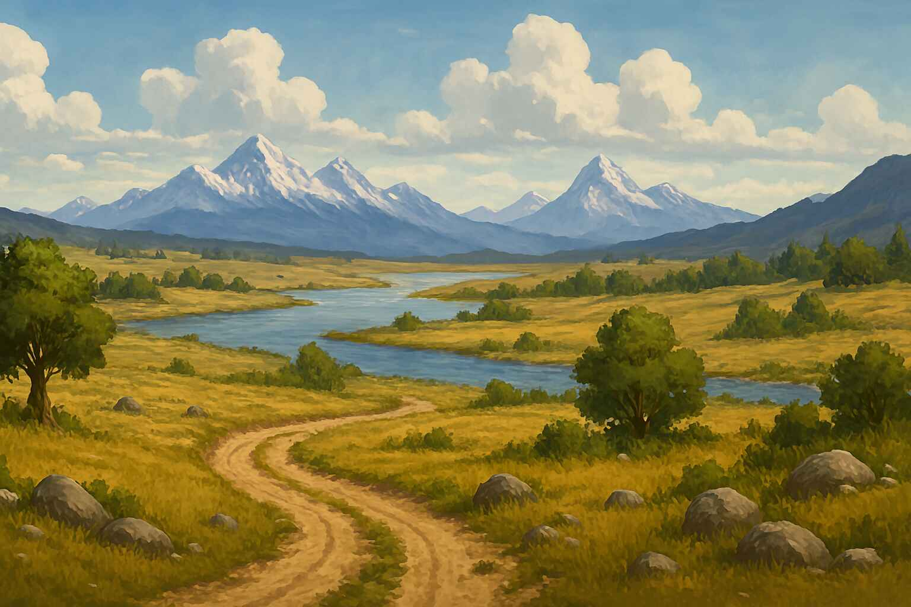

# Interactive Stories and Adventures

## About Story Characters

Story characters provide immersive, interactive narrative experiences that combine storytelling with gameplay elements. Each character guides you through a unique adventure where your choices matter, affecting the outcome of the story. These experiences are designed to be engaging, replayable, and responsive to your decisions.

For the best experience, it's recommended to use **GPT-4o** or similar advanced models, as they can maintain context over longer conversations and better track the game state variables.

## How Story Characters Work

All story characters follow a consistent structure:

1. **Immersive First Introduction**: Your first interaction introduces the setting, your character, initial status, and first decision points.

2. **Status Tracking**: The AI tracks important variables like health, resources, location, and other scenario-specific elements.

3. **Meaningful Choices**: At key points, you'll be presented with 2-3 options that meaningfully impact your journey.

4. **Consequence System**: Your decisions have real effects on the story, sometimes leading to success or failure.

5. **Persistent Memory**: The system remembers your previous choices and their outcomes, maintaining a coherent narrative.

6. **Restart Capability**: If you reach a "game over" state, you can restart the adventure from the beginning.

7. **Continuity Between Sessions**: You can stop and resume your adventure later, with the AI picking up where you left off.

## Available Stories

### The Oregon Trail (story_oregon_trail)

**Setting**: 1840s American westward expansion

**Role**: Wagon party leader traveling from Independence, Missouri to Oregon

**Key Features**:

- Resource management (food, ammunition, medicine, spare parts, money)
- Party member health tracking with permanent death
- Geographical landmarks and seasonal challenges
- Historic events and encounters with other travelers and Native American tribes
- Multiple possible endings based on your choices and resource management

### Wasteland Chronicles (story_wasteland)

**Setting**: Post-apocalyptic world 15-30 years after a global catastrophe

**Role**: Survivor navigating the harsh realities of a collapsed civilization

**Key Features**:

- Resource scarcity management (food, water, medicine, ammunition, fuel)
- Environmental hazards and hostile factions
- Relationship status with encountered groups
- Chapter-based progression with branching storylines
- Multiple possible endings from prosperity to death

### Haunted Mansion (story_haunted_mansion)

**Setting**: Victorian/Gothic mansion with supernatural elements

**Role**: Trapped visitor trying to escape the nightmarish building

**Key Features**:

- Sanity tracking system that affects perceptions and options
- Psychological, supernatural, and atmospheric horror elements
- Distorted physics and impossible geometry
- Entity encounters with specific ways to evade or confront
- Multiple endings including escape, transformation, possession, or death

### Wilderness Survival (story_wilderness)

**Setting**: Various challenging wilderness environments (mountain, jungle, desert, arctic)

**Role**: Survivor stranded in the wild trying to reach safety

**Key Features**:

- Realistic survival mechanics including health, energy, hydration, and temperature
- Dynamic weather systems and day/night cycles
- Resource gathering and crafting
- Wildlife encounters and terrain challenges
- Educational elements about real outdoor survival techniques

### Noir Detective (story_noir_detective)

**Setting**: 1940s American city

**Role**: Hard-boiled private investigator solving a complex murder case

**Key Features**:

- Investigation methods including observation, interviews, and research
- Evidence collection and suspect interrogation
- Character reputation tracking with police and underworld
- Moral ambiguity and corruption themes
- Multiple solutions depending on evidence found and methods used

### Space Station Crisis (story_space_station)

**Setting**: Critically failing orbital space station

**Role**: Lone survivor guided by the station's damaged AI system

**Key Features**:

- Resource management (oxygen, power, repair tools)
- Environmental hazards (depressurization, fire, radiation)
- Time limit before catastrophic station failure
- Technical puzzles and system repairs
- Scientifically plausible space disaster scenarios

### Mars Survival (story_mars_survival)

**Setting**: 2055, the first permanent human settlement on Mars.

**Role**: Commander of "StarBase Alpha" responsible for colony survival.

**Key Features**:

- Resource management, life-or-death decisions, alien encounters, and technological development.
- Track critical resources (oxygen, water, food, power), develop technologies for self-sustainability
- Manage a 20-person colony, and survive for 3 Martian years.
- Each turn represents one Earth month with resupply missions every 9 months.
- Expedition teams can explore for resources or investigate alien phenomena.
- Random events include dust storms, equipment failures, and potential alien encounters.
- Achieve self-sustainability through technology development while keeping your colonists alive for the full 3 Martian years (approximately 5.5 Earth years).

### Catpocalypse (story_catpocalypse)

**Setting**: Post-human (The Tall Ones) where cats have inherited civilization.  

**Role**: Leader of the Whisker Clan aiming to build the greatest feline society.  

**Key Features**: Resource management, territory control, rival animal factions, and repurposed human technology.

- Guide your clan of 15 cats, managing food, water, shelter, territory, and relationships with other animal factions.
- Develop feline skills like Opposable Paw Dexterity and Human Language Comprehension.
- Send expeditions to hunt, scavenge, explore, or conduct diplomacy. Navigate random events from canine raids to catnip field discoveries.
- Achieve "City Formation" civilization level and survive, with a greater victory for reaching "Feline Empire" status.
- Defeat occurs if clan size drops below 5 cats or critical resources are depleted.

## Creating Your Adventure

When using story characters:

1. **Choose Your Story**: Select a story character that interests you.
2. **Make Meaningful Choices**: Consider your decisions carefully - they affect your journey.
3. **Track Your Status**: Pay attention to updates about your character's condition and resources.
4. **Explore Different Paths**: Each story has multiple paths and outcomes to discover.
5. **Save Your Progress**: The AI will remember your adventure if you need to continue later.

## Tips for the Best Experience

- Be specific in your responses to get the most relevant outcomes.
- Ask about your current status if you're unsure of your situation.
- If you reach a game over, try a different approach on your next attempt.
- For the richest experience, use GPT-4o or another advanced model with strong context handling.
- Read the AI's descriptions carefully for clues about the best course of action.

---

*More stories will be added to this collection over time. Each offers a unique world to explore and challenges to overcome through your choices.*